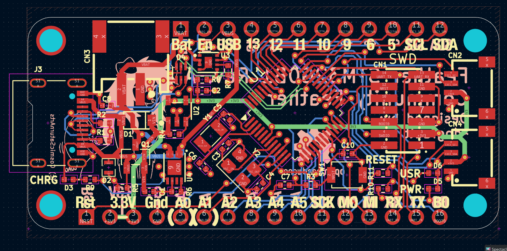

# prop-devboard

A STM32G0B1-based development board meant for prop making, inspired by Adafruits Feather series of boards

## Features 
* Compatible with most (if not all!) Feather Wing addon boards
* Two independant QWIIC ports, connected to `I2C1` and `I2C2`, respectively
* +3V3 power supply that can deliver 500mA of power
* JST PH2.0 port for LiPo battery, and circuitry for powering off battery:
     * Automatic and safe switching between USB and LiPo battery as power source, even with both connected at the same time
     * Safe battery charging using `MCP73831` over the USB-C port
     * Battery level monitoring using `MAX17048G`
* STDC14 programming header, compatible with STLINK-V3MINIE
* Both HSE (8 MHz) and LSE (32.768 KHz) crystals

## Images

")

")

")
